# 🛍️ Awesome E-Commerce Platforms & Frameworks

  

  
  
  
  
  

---

## 🌟 Overview & Market Summary

**Awesome E-Commerce** is a community-curated directory tracking leading **SaaS/hosted platforms** and **open-source projects** for online stores, headless commerce architectures, multi-vendor marketplaces, B2C/B2B catalogs, checkout systems, and omnichannel trade.

Whether you are launching a DTC brand, scaling a global multi-store enterprise, or building custom headless API integrations with Next.js, Remix, or mobile apps, this guide highlights top-tier options with transparent pricing, free tier limits, company valuations, and GitHub community stats.

---

## 📌 Table of Contents

- [☁️ SaaS & Hosted Platforms](#%EF%B8%8F-saas--hosted-platforms)
- [🔓 Open-Source GitHub Projects](#-open-source-github-projects)
- [🧩 Additional E-Commerce Ecosystem Tools](#-additional-e-commerce-ecosystem-tools)
- [🤝 How to Contribute](#-how-to-contribute)
- [⚠️ Disclaimer](#%EF%B8%8F-disclaimer)
- [📈 Star History](#-star-history)

---

## ☁️ SaaS & Hosted Platforms

> 📊 **Market Insights:** The global e-commerce software market size is estimated at **$7.5B – $8.5B (2026)** and projected to reach **$15B+ by 2030**. The sector is **moderately fragmented**: while hosted solutions like **Shopify** dominate SMB & DTC retail, enterprise and composable segments remain fragmented among **Salesforce**, **Adobe**, **BigCommerce**, **VTEX**, and headless API engines.

| Platform | Description | Company Size (Revenue / Valuation) | Pricing | Free Tier / Trial Limits |
| --- | --- | --- | --- | --- |
| **[Salesforce Commerce Cloud](https://www.salesforce.com/products/commerce-cloud/overview/)** | Enterprise commerce solution tightly integrated with the Salesforce CRM ecosystem for B2C and B2B experiences. | ~$35B Annual Revenue / ~$270B Market Cap | Starts at 1% of GMV (minimum ~$50,000/year contract depending on scale and edition) | No self-service free trial (30-day sales-assisted sandbox environment available upon request) |
| **[Adobe Commerce (Magento)](https://business.adobe.com/products/magento/magento-commerce.html)** | Enterprise commerce platform offering deep customization, B2B capabilities, and complex catalog support. | ~$21.5B Annual Revenue / ~$230B Market Cap | Starts at ~$22,000/year (~$1,833/mo based on annual GMV/revenue) | No self-service free trial (sales-assisted demo sandbox available; Magento Open Source is free self-hosted) |
| **[Shopify](https://www.shopify.com/)** | Leading hosted e-commerce platform known for ease of use, extensive app ecosystem, and strong DTC/conversion focus. | ~$7.1B Annual Revenue / ~$95B Market Cap | Starts at $39/mo ($29/mo billed annually for Basic tier; $5/mo Starter plan) | 3-day free trial (no credit card required; store checkout disabled until paid plan selection) |
| **[VTEX](https://vtex.com/)** | Cloud commerce platform strong in Latin America and global markets, supporting marketplaces and composable architectures. | ~$1.3B Valuation / ~$200M Annual Revenue | Starts at ~$250/mo (base platform fee plus variable revenue share of ~1–3% GMV) | No self-service free trial (sales-assisted demo environment available upon request) |
| **[commercetools](https://commercetools.com/)** | Leading composable / MACH commerce platform for large enterprises needing API-first, headless commerce at scale. | ~$1.5B Valuation (~$100M ARR) | Starts at ~$40,000/year (~$3,333/mo base fee scaled by order volume and API usage) | 60-day free trial (full API access & Merchant Center; restricted to non-production dev environments) |
| **[BigCommerce](https://www.bigcommerce.com/)** | Open-SaaS e-commerce platform popular for mid-market and enterprise merchants seeking flexibility without self-hosting overhead. | ~$550M Market Cap / ~$320M Annual Revenue | Starts at $39/mo ($29/mo billed annually for Core tier up to $50k annual GMV) | 15-day free trial (no credit card required; custom domains & certain extensions restricted until upgrade) |
| **[Ecwid](https://www.ecwid.com/)** | Lightweight, easy-to-add e-commerce solution often embedded into existing websites and social channels. | ~$500M Acquisition Valuation (Lightspeed ~$900M Revenue) | Free forever tier; paid plans start at $35/mo ($29/mo billed annually for Venture plan) | Free forever plan limited to 10 products (or 5 via partner apps), basic storefront, 0% platform transaction fee |
| **[Shopware (Cloud / commercial editions)](https://www.shopware.com/)** | Flexible commerce platform with strong European presence; commercial cloud offerings built on an open core. | ~$500M Valuation (~$70M ARR) | Starts at €600/mo (for Cloud Rise edition) | 14-day free trial for Cloud Rise plan (Community Edition is free self-hosted) |

*💡 Note: Additional SaaS and enterprise solutions cover subscription billing, headless cart APIs, and niche vertical commerce requirements.*

---

## 🔓 Open-Source GitHub Projects

E-commerce boasts one of the richest open-source developer communities. Below are top active self-hosted and headless open-source projects, **sorted by GitHub star counts (descending)**:

1. **[Medusa](https://github.com/medusajs/medusa)**   
   Fast-growing open-source headless commerce platform built with Node.js/TypeScript. Highly modular, developer-friendly, and popular for composable storefronts.

2. **[Bagisto](https://github.com/bagisto/bagisto)**   
   Laravel-based open-source e-commerce platform supporting multi-vendor marketplaces, B2B portals, headless setups, and modern PHP development.

3. **[Saleor](https://github.com/saleor/saleor)**   
   GraphQL-first, open-source headless commerce engine (Python/Django) designed for high-performance, multi-channel, and composable architectures.

4. **[Spree](https://github.com/spree/spree)**   
   Ruby on Rails-based open-source e-commerce platform known for flexibility, modular storefronts, and developer control.

5. **[Reaction Commerce](https://github.com/reactioncommerce/reaction)**   
   Event-driven, real-time commerce engine built with Node.js and GraphQL for modern microservice architectures.

6. **[Magento Open Source](https://github.com/magento/magento2)**   
   Feature-rich open-source e-commerce platform offering deep customization, extensive extension ecosystem, and foundation for enterprise Adobe Commerce.

7. **[WooCommerce](https://github.com/woocommerce/woocommerce)**   
   The most widely used open-source e-commerce plugin for WordPress, powering millions of stores with a massive plugin ecosystem.

8. **[nopCommerce](https://github.com/nopSolutions/nopCommerce)**   
   Popular open-source e-commerce shopping cart built on ASP.NET Core with multi-store and multi-vendor support.

9. **[PrestaShop](https://github.com/PrestaShop/PrestaShop)**   
   Mature open-source e-commerce solution with a large international community, extensive modules, and multi-language/multi-currency capabilities.

10. **[Aimeos Laravel](https://github.com/aimeos/aimeos-laravel)**   
    Ultra-fast open-source PHP e-commerce framework and Laravel package supporting multi-vendor, multi-warehouse, and gigabyte-scale catalogs.

11. **[Sylius](https://github.com/Sylius/Sylius)**   
    Flexible, Symfony-based open-source e-commerce framework emphasizing clean code architecture, B2B features, and extensibility.

12. **[Vendure](https://github.com/vendure-ecommerce/vendure)**   
    Open-source headless commerce platform built with TypeScript, NestJS, and GraphQL, suitable for D2C, B2B, and omnichannel applications.

13. **[OpenCart](https://github.com/opencart/opencart)**   
    Lightweight, turn-key open-source PHP shopping cart platform with multi-store management and simple store setup.

14. **[Solidus](https://github.com/solidusio/solidus)**   
    Community-driven Ruby on Rails open-source e-commerce platform designed for complex customization and high transaction volume.

15. **[Shopizer](https://github.com/shopizer-ecommerce/shopizer)**   
    Java Spring Boot open-source headless e-commerce software offering REST APIs and admin control panel.

16. **[Lunar PHP](https://github.com/lunarphp/lunar)**   
    Modern, open-source headless e-commerce package for Laravel, enabling custom storefront development.

17. **[Shopware Community Edition](https://github.com/shopware/shopware)**   
    Open-source edition of Shopware, a modern PHP/Symfony commerce platform popular in Europe with strong theming and extension APIs.

---

## 🧩 Additional E-Commerce Ecosystem Tools

- **Storefront Starters**: Next.js Commerce, Gatsby Storefront, Remix Templates designed to pair with Medusa, Saleor, Vendure, or Shopify Storefront API.
- **Payment & Checkout Integrations**: Stripe Elements, PayPal Checkout, Adyen, Braintree, Klarna, and Mollie SDKs.
- **Search & Discovery Engines**: Algolia, Typesense, Meilisearch, and Elasticsearch product discovery plugins.
- **Headless CMS Pairings**: Strapi, Sanity, Contentful, and Payload CMS for rich content management alongside commerce backends.
- **Marketplace & Multi-Vendor Modules**: Multi-seller dashboard plugins and commission splitting infrastructure.

---

## 🤝 How to Contribute

1. Fork this repository.
2. Add or edit entries in `README.md` following the standard table or list structure.
3. Ensure links point to official documentation/repositories and include factual pricing & open-source details.
4. Open a Pull Request with a brief explanation of your additions.

Explore more curated developer lists at [Awesome-Awesome-Awesome](https://github.com/ishandutta2007/Awesome-Awesome-Awesome)!

---

## ⚠️ Disclaimer

- This list is community-curated for informational purposes and does not constitute endorsement.
- E-commerce applications process financial transactions, personally identifiable information (PII), and inventory data. Operators are responsible for security patching, PCI-DSS compliance, and local tax compliance.

---

## 📈 Star History

---

  Made with ❤️ for merchants, CTOs, software engineers, and e-commerce architects.

